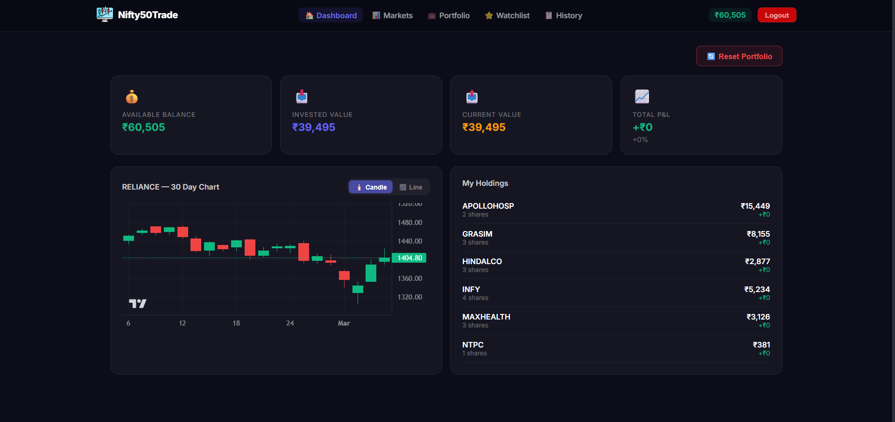
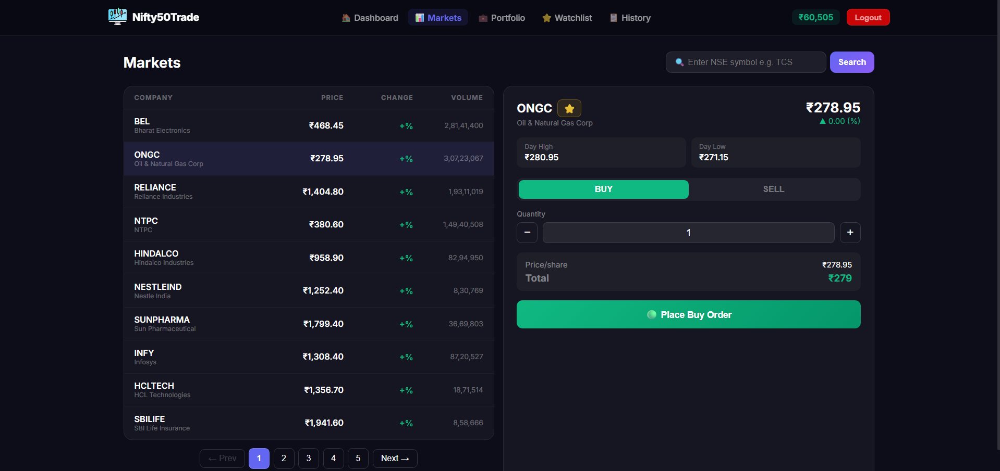
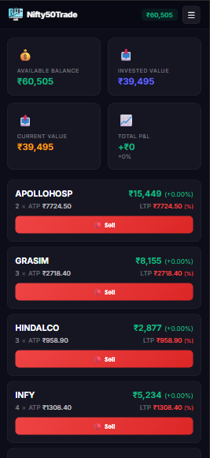

# 📈 Nifty50Trade

A full-stack paper trading simulator for the Indian stock market. Practice trading all 50 Nifty 50 stocks with ₹1,00,000 virtual money — no real money at risk.

   

---

## 🚀 Features

- 📊 **Live Nifty 50 Prices** — Real-time stock prices via Yahoo Finance
- 💰 **Paper Trading** — Buy & sell stocks with ₹1,00,000 virtual money
- 📈 **Candlestick Charts** — 30-day OHLC chart with candle/line toggle
- 💼 **Portfolio Tracking** — Live P&L calculations on all holdings
- ⭐ **Watchlist** — Save and monitor stocks
- 📋 **Trade History** — Paginated transaction history
- 🔄 **Reset Portfolio** — Start fresh anytime
- 📱 **Mobile Responsive** — Works on all screen sizes
- 🔐 **JWT Authentication** — Secure login & register

---

## 🛠️ Tech Stack

### Frontend
| Technology | Purpose |
|---|---|
| React 19 + Vite | UI Framework |
| React Router v7 | Client-side routing |
| Axios | API calls |
| Lightweight Charts | Candlestick charts |
| Context API | Global state management |

### Backend
| Technology | Purpose |
|---|---|
| Node.js + Express | REST API server |
| MongoDB Atlas | Cloud database |
| Mongoose | ODM for MongoDB |
| JWT | Authentication |
| bcryptjs | Password hashing |
| Yahoo Finance API | Live stock prices |

---

## 📁 Project Structure

```
Nifty50Trade/
├── client/                 # React frontend
│   ├── src/
│   │   ├── api/            # Axios API calls
│   │   ├── components/     # Reusable UI components
│   │   ├── context/        # Auth & Toast context
│   │   ├── hooks/          # Custom hooks
│   │   ├── pages/          # Page components
│   │   ├── styles/         # Global CSS
│   │   └── utils/          # Helper functions
│   └── package.json
│
└── server/                 # Node.js backend
    ├── config/             # Database config
    ├── controllers/        # Route logic
    ├── middleware/         # Auth middleware
    ├── models/             # Mongoose schemas
    ├── routes/             # Express routes
    ├── utils/              # Yahoo Finance helper
    └── package.json
```

---

## ⚙️ Getting Started

### Prerequisites
- Node.js v18+
- MongoDB Atlas account (free tier)

### 1. Clone the repository
```bash
git clone https://github.com/YOUR_USERNAME/nifty50trade.git
cd nifty50trade
```

### 2. Setup Backend
```bash
cd server
npm install
```

Create a `.env` file in the `server/` folder:
```env
PORT=5000
MONGO_URI=your_mongodb_atlas_connection_string
JWT_SECRET=your_jwt_secret_key
JWT_EXPIRES_IN=7d
STARTING_BALANCE=100000
```

Start the server:
```bash
npm run dev
```

### 3. Setup Frontend
```bash
cd client
npm install
```

Create a `.env` file in the `client/` folder:
```env
VITE_API_URL=http://localhost:5000/api
```

Start the frontend:
```bash
npm run dev
```

### 4. Open the app
Visit `http://localhost:5173` in your browser.

---

## 🔌 API Endpoints

### Auth
| Method | Endpoint | Description |
|---|---|---|
| POST | `/api/auth/register` | Register new user |
| POST | `/api/auth/login` | Login user |
| GET | `/api/auth/me` | Get current user |

### Stocks
| Method | Endpoint | Description |
|---|---|---|
| GET | `/api/stocks/popular` | Get all Nifty 50 stocks |
| GET | `/api/stocks/search/:symbol` | Search stock by symbol |
| GET | `/api/stocks/chart/:symbol` | Get 30-day chart data |

### Trading
| Method | Endpoint | Description |
|---|---|---|
| POST | `/api/trade/buy` | Buy shares |
| POST | `/api/trade/sell` | Sell shares |
| GET | `/api/trade/history` | Get trade history |

### Portfolio
| Method | Endpoint | Description |
|---|---|---|
| GET | `/api/portfolio` | Get holdings with P&L |
| POST | `/api/portfolio/reset` | Reset portfolio |

### Watchlist
| Method | Endpoint | Description |
|---|---|---|
| GET | `/api/watchlist` | Get watchlist |
| POST | `/api/watchlist/:symbol` | Add to watchlist |
| DELETE | `/api/watchlist/:symbol` | Remove from watchlist |

---

## 📸 Screenshots

### Dashboard


### Markets


### Mobile


---

## 🔐 Environment Variables

### Server `.env`
```env
PORT=5000
MONGO_URI=mongodb+srv://<user>:<password>@cluster.mongodb.net/nifty50trade
JWT_SECRET=your_super_secret_key
JWT_EXPIRES_IN=7d
STARTING_BALANCE=100000
```

### Client `.env`
```env
VITE_API_URL=http://localhost:5000/api
```

> ⚠️ Never commit `.env` files to GitHub

---

## 🚀 Deployment

- **Frontend** → [Vercel](https://vercel.com)
- **Backend** → [Render](https://render.com)
- **Database** → [MongoDB Atlas](https://cloud.mongodb.com)

---

## 📄 License

MIT License — feel free to use this project for learning and portfolio purposes.

---

## 👨‍💻 Author

Built with ❤️ as a portfolio project to demonstrate full-stack development skills.